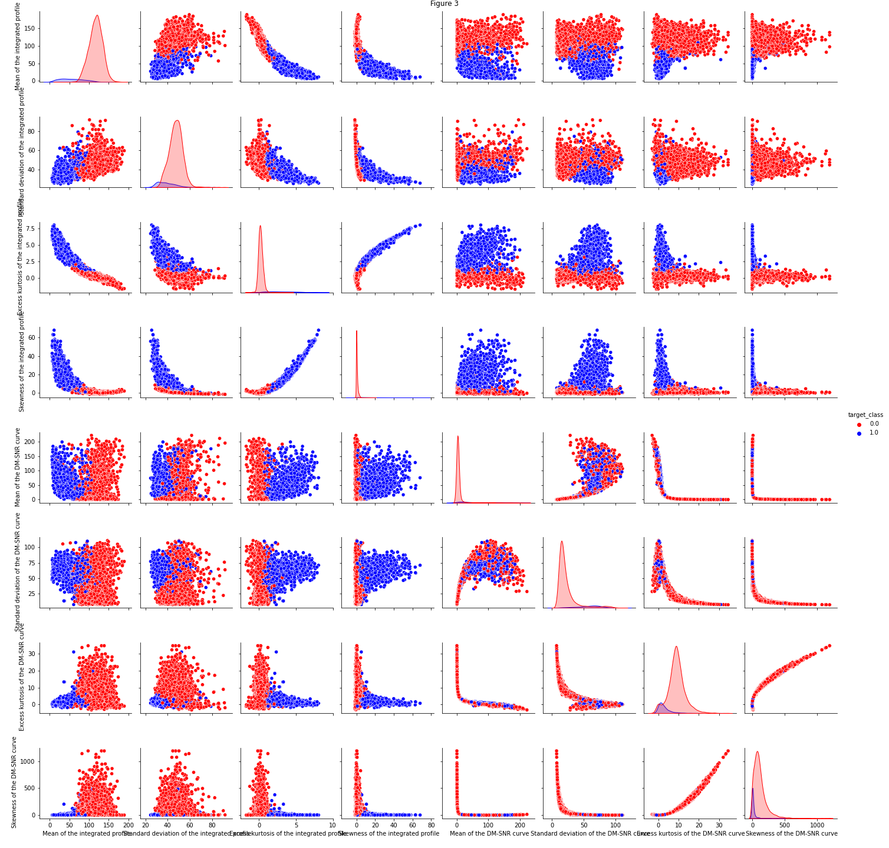

<h1 align="center">Machine Learning Models for Pulsar Classification</h1>
<h2 align="center">Evaluation ML techniques to improve Pulsar's Classification Tasks</h2>


---


## Quick summary: ##

* The problem of classifying Pulsars has been approached from different angles, and more recently focus has been put on Machine Learning as a tool to speed the classification process up.

* Here we use a well known pulsars survey database to test different classification models and to evaluate how to improve the accuracy.

* We have applied **Random Forest** and **Neural Networks** together with **Data Oversampling Technique** in order to improve accuracy as the original database is highly umbalanced.


    - Version: 1.0
   -   [Share this repo](https://github.com/Jorgecardenas1/pulsar_classification_machine_learning)

## Content ##
```
root
│   README.md
│       
└───Pulsar Classification
   │   pulsar_data_test.csv
   |   pulsar_data_train.csv
   │   Pulsar_ML_V1.ipyb
   └───images
       │   Multiples images files
```

### Setup and run ###
1. Open Pulsar_ML_V1.ipyb
2. The notebook is set in a way that it downloads and installs all dependencies required to run.
3. There is no need to set variables or parameters. 

4. ***Index***:
There are different processes worked out through out the notebook. Here is a brief description of everyone of them:


| Section          | Subsection                                      | Description                                                                                                                                                                           |
|------------------|-------------------------------------------------|---------------------------------------------------------------------------------------------------------------------------------------------------------------------------------------|
| Data Exploration | Profiles                                        | A Brief description of the theory behing Pulsar Integrated Profile and the entries of the Data frame                                                                                  |
| Data Exploration | Correlation                                     | An analysis of how the data is correlated. This initial approximation removes all NAN values in all columns to deal with them. This is improved by imputing data in further sections. |
| Pre-processing   | Exploratory Decision Tree Classifier            | This is a preliminary classification based on the data we have so far.                                                                                                                |
| Pre-processing   | Imputing and preparation                        | This section is focused on Normalizing, Standardizing Data, and Imputing. This technique is way better than just removing the NAN values.                                             |
| Pre-Processing   | Exploratory Random Forest with Standardize Data | We just use the processed dataset to build a classification model, which proves to improve in accuracy.                                                                               |
| Model            | Neural Network                                  | In this section is built a Neural Network model (2 inner layers) and one sigmoid output layer to work as a binary classification model.)                                              |
| Model            | Processing by oversampling                      | The data set is very umbalanced, so we implement an oversampling technique to generate a more balanced dataset to be tested with a new neural network.                                |
| Model            | Neural Network with Balanced Data               | The model is tested using the newly created dataset together with all previous techniques, yielding and improvement in the classification accuracy.                                   |

### Results ###

* In images folder you can find the plots after running the notebook.


